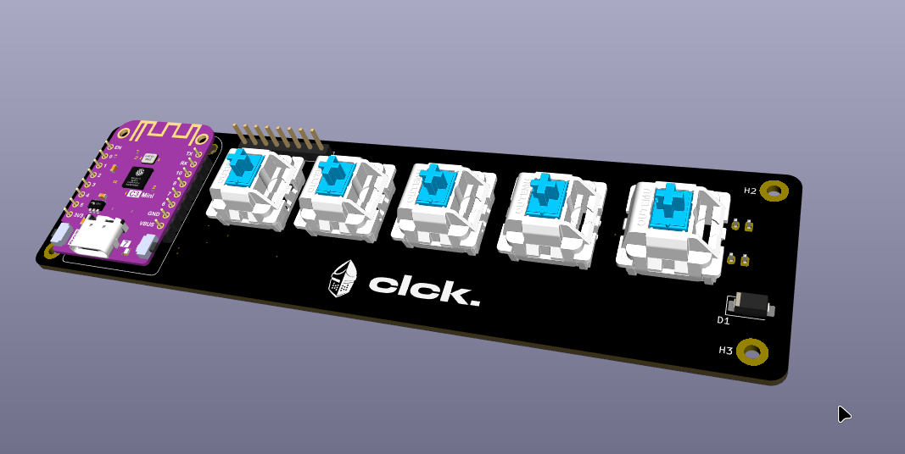
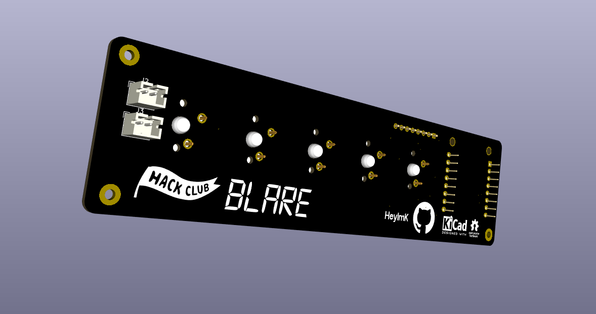
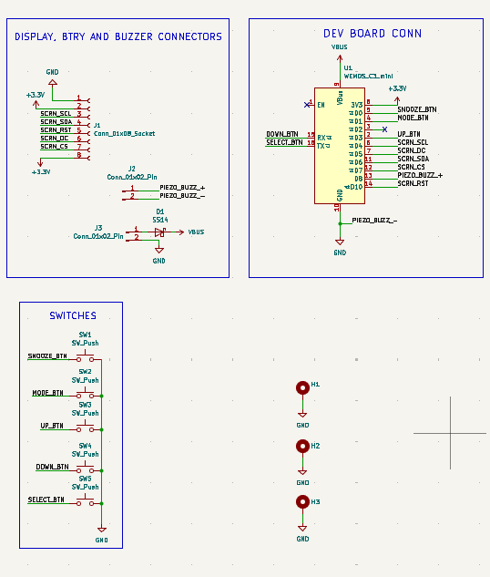
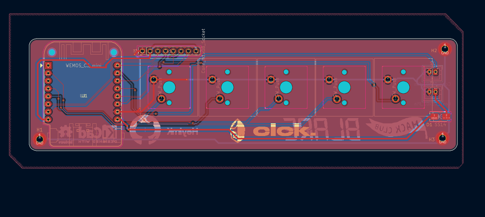

# BLARE Alarm Clock

A custom battery-powered alarm clock built for the [Hack Club BLARE](https://blare.hackclub.com/) program.

The goal of this project was simple: build an alarm clock that doesn't use cheap rubber buttons. Instead, it uses four Cherry MX mechanical keyboard switches, a custom PCB, and a 3D printed enclosure. Everything is powered by a Wemos ESP32-C3 Mini, which handles the display, buttons, and alarm.

## Overview

### Enclosure

| Front | Back |
|-------|------|
|  |  |

### PCB

| Front | Back |
|-------|------|
|  |  |

### Electronics

| Schematic | PCB Routing |
|-----------|-------------|
|  |  |

## Hardware

- Wemos ESP32-C3 Mini
- 2.25" SPI TFT display
- 4 Cherry MX-style mechanical switches
- Piezo buzzer
- 3.7V LiPo battery
- TP4056 charging module
- Schottky diode (SS14 or 1N5817 recommended)

The battery connects through a JST 2.0 connector and is charged using a TP4056 module. A Schottky diode is used on the VBUS line to help prevent reverse current and reduce voltage drop.

## Pin Mapping

The ESP32-C3 Mini doesn't have many GPIOs, so the pins had to be used carefully. Since the board has native USB, GPIO20 (RX) and GPIO21 (TX) can still be used as normal GPIO without affecting programming.

| Component | ESP32-C3 Pin(s) | Notes |
|-----------|-----------------|-------|
| Display (SPI) | GPIO4, GPIO6, GPIO7, GPIO2, GPIO10 | SCK, MOSI, CS, DC, RST |
| Piezo buzzer | GPIO8 | Connected to the positive terminal |
| Buttons | GPIO0, GPIO1, GPIO20, GPIO21 | `INPUT_PULLUP` |
| Battery input | VBUS | Regulated to 3.3V onboard |

## Building

1. Install the ESP32 board package by Espressif.
2. Select **LOLIN C3 Mini** as the target board.
3. Clone the repository.

```bash
git clone https://github.com/YOUR_USERNAME/BLARE-Alarm-Clock.git
```

4. Open the project in the Arduino IDE or PlatformIO.
5. Install the required libraries (I used `TFT_eSPI`).
6. Connect the board over USB-C and upload the firmware.

## Assembly

The switch plate is designed around a thickness of **1.5 mm**. Making it thicker will prevent the Cherry MX switches from snapping into place correctly.

Before soldering, make sure every component shares a common ground and verify the battery polarity.

## License

MIT
