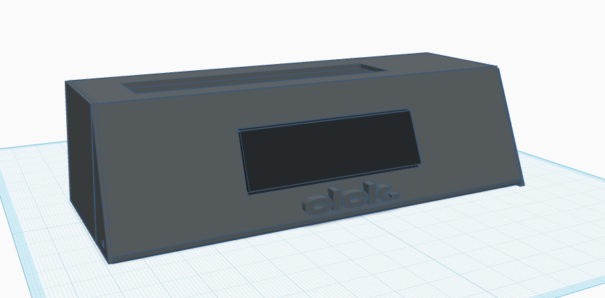
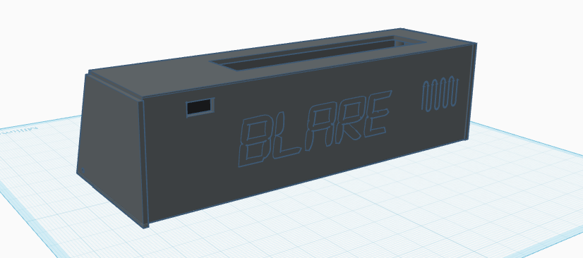

# clck.

A custom battery-powered alarm clock built for the [Hack Club BLARE](https://blare.hackclub.com/) program.

The goal of this project was simple: build an aesthetic alarm clock with a hint of brutalism style that doesn't use cheap rubber buttons. Instead, it uses four Cherry MX mechanical keyboard switches, a custom PCB, and a 3D printed enclosure. Everything is powered by a Wemos ESP32-C3 Mini, which handles the display, buttons,buzzer, etc. Btw Sponsored by Hack Club too!!!

## Overview

### Enclosure

| Front | Back |
|-------|------|
|  |  |

### PCB

| Front | Back |
|-------|------|
|  |  |

### Electronics

| Schematic | PCB Routing |
|-----------|-------------|
|  |  |

## Hardware

- Wemos ESP32-C3 Mini dev-board
- 2.25" SPI TFT display
- 4 Cherry MX mechanical switches
- Piezo buzzer
- Schottky diode (SS14)

The battery connects through a JST 2.0 connector and is charged using a external TP4056 module. 

## Pin Mapping

The ESP32-C3 Mini doesn't have many GPIOs, so every pin has been used by the display,buttons,buzzer etc.  

| Component | ESP32-C3 Pin(s) | Notes |
|-----------|-----------------|-------|
| Display (SPI) | GPIO4, GPIO6, GPIO7, GPIO2, GPIO10 | SCK, MOSI, CS, DC, RST |
| Piezo buzzer | GPIO8 | Connected to the positive terminal |
| Buttons | GPIO0, GPIO1, GPIO20, GPIO21 | Main control buttons |
| Battery input | VBUS |Connect to a charging module first |

## Assembly

The switch plate is designed around a thickness of **1.5 mm**. Making it thicker will prevent the Cherry MX switches from snapping into place correctly.

Before connecting the battery check the battery polarity.

## License

CERN-OHL-S-2.0 license 
